# os32

Apps and UI for the ESP32-S3 — terminal-style interface on a 320x240 display with WiFi, camera, SD card, and Spotify remote control.

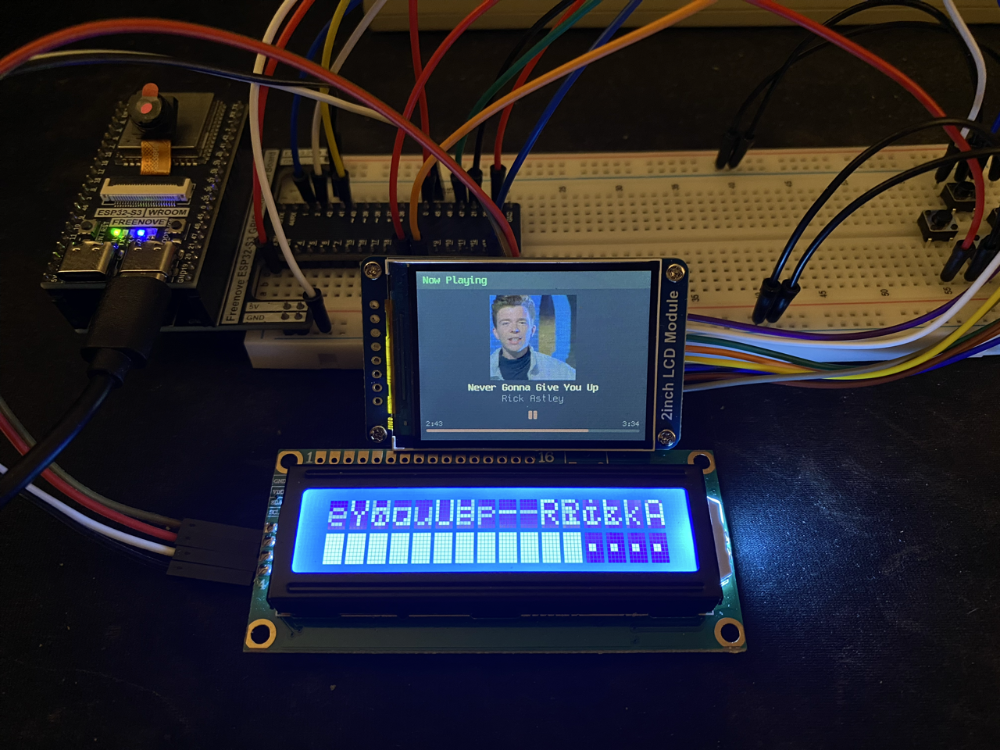

## Features

- **App launcher** with navigable menu (4-button input: up/down/left/right)
- **Spotify remote** — OAuth PKCE auth, now playing with album art, play/pause, skip, volume control, accent color extraction from artwork
- **Camera** — live preview and photo capture (OV3660) with SD card storage
- **File browser** — navigate SD card contents with thumbnail previews for BMP/JPEG
- **File server** — HTTP file server with web UI for downloading, deleting, and sorting files by name/size/date
- **System monitor** — free heap, PSRAM, CPU frequency, uptime, WiFi RSSI
- **Settings** — WiFi setup (captive portal), display brightness, sleep timer, timezone (21 zones with automatic DST), 12/24h clock, power management (reboot/sleep/shutdown)
- **Screenshot** — UP+DOWN combo saves the current screen to SD card
- **Secondary display** — 1602 I2C LCD shows contextual status per app
- **Idle sleep** — configurable auto-sleep with display off, wake on button press

## Apps

### Launcher

<p align="center">
  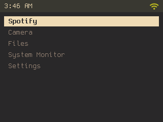
</p>

### Spotify

Now playing display with album art (120x120, center-cropped for video thumbnails), progress bar with accent color extracted from artwork, elapsed/total time. Hold right to skip, tap right to play/pause, up/down for volume.

<p align="center">
  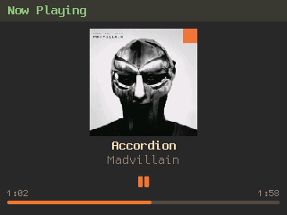
  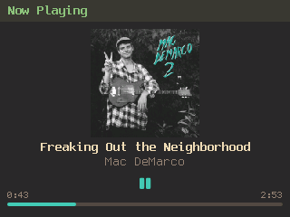
  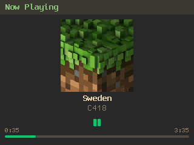
</p>

First-time setup — scan the QR code or visit the auth URL to link your Spotify account. See [Spotify Setup](#spotify-setup) for details.

<p align="center">
  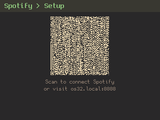
</p>

### Files

Browse SD card directory tree. Thumbnail previews for BMP and JPEG files. Delete files with confirmation. Integrated HTTP file server with web UI for remote access.

<p align="center">
  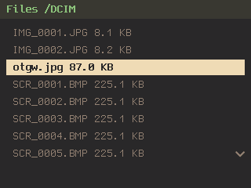
  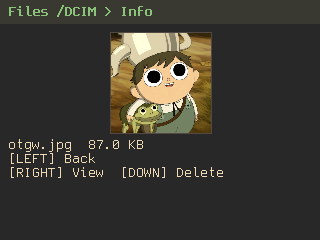
  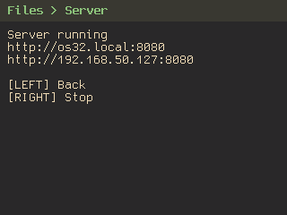
</p>

<p align="center">
  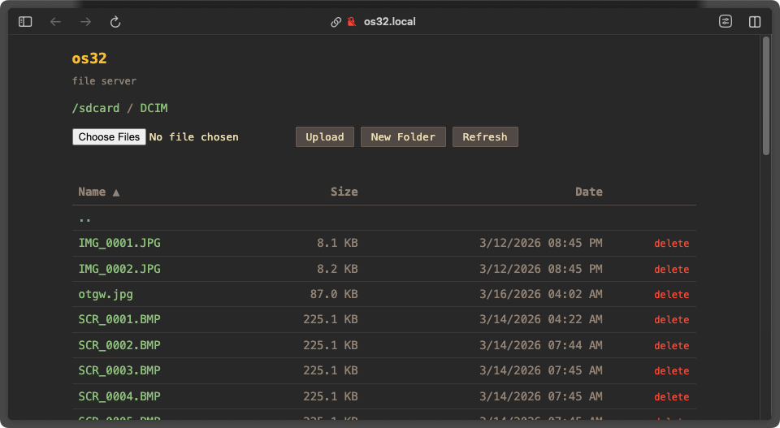
</p>

### System Monitor

Displays free heap, PSRAM usage, CPU frequency, uptime, WiFi signal strength, and IP address.

<p align="center">
  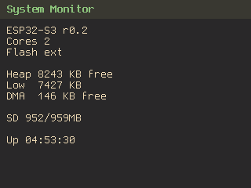
</p>

### Settings

#### WiFi

Connect to a network via captive portal. View connection status, change or forget saved networks.

<p align="center">
  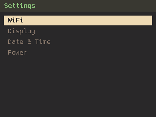
  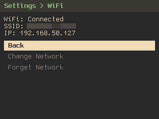
</p>

<p align="center">
  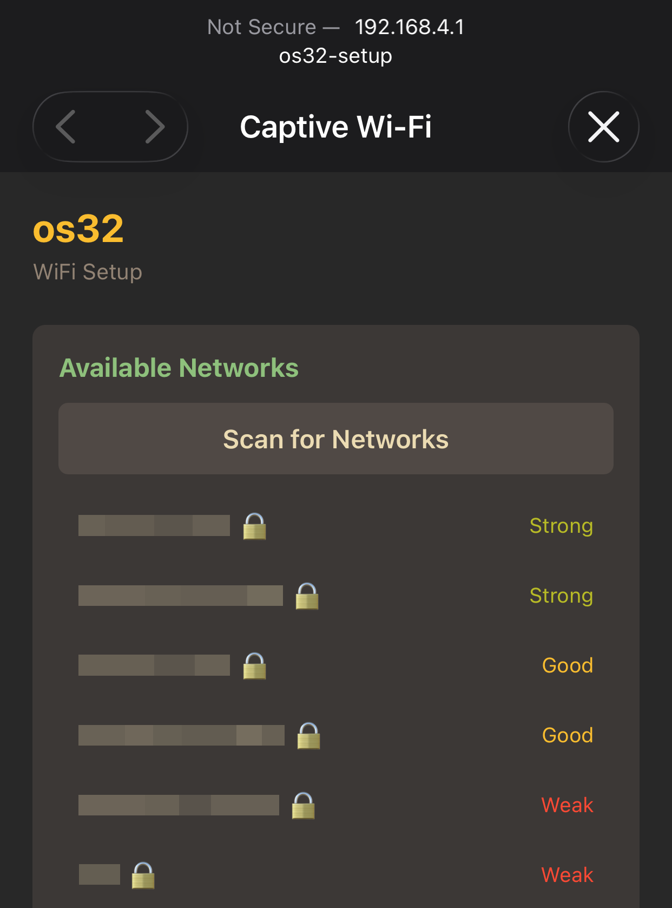
</p>

#### Display

Brightness control and configurable sleep timer.

<p align="center">
  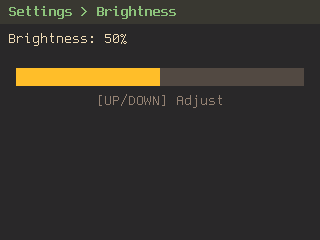
  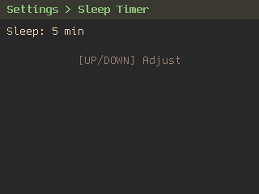
</p>

#### Date & Time

Timezone selection (21 zones with automatic DST) and 12/24h clock toggle.

<p align="center">
  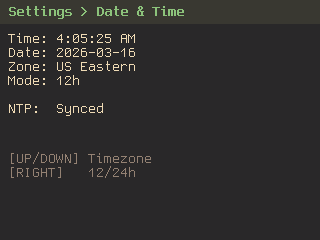
</p>

## Hardware

### Components

| Component | Model | Notes |
|-----------|-------|-------|
| MCU | [Freenove ESP32-S3 WROOM N8R8](https://docs.freenove.com/projects/fnk0084/en/latest/) | 8MB flash, 8MB PSRAM |
| Display | ST7789V 240x320 | SPI, 16-bit RGB565 |
| Camera | OV3660 | Via FPC ribbon cable |
| SD Card | Onboard SDMMC | 1-bit mode |
| LCD | 1602 I2C (PCF8574) | Secondary status display |
| Buttons | 4x tactile switches | Active low, internal pull-up |

### Wiring

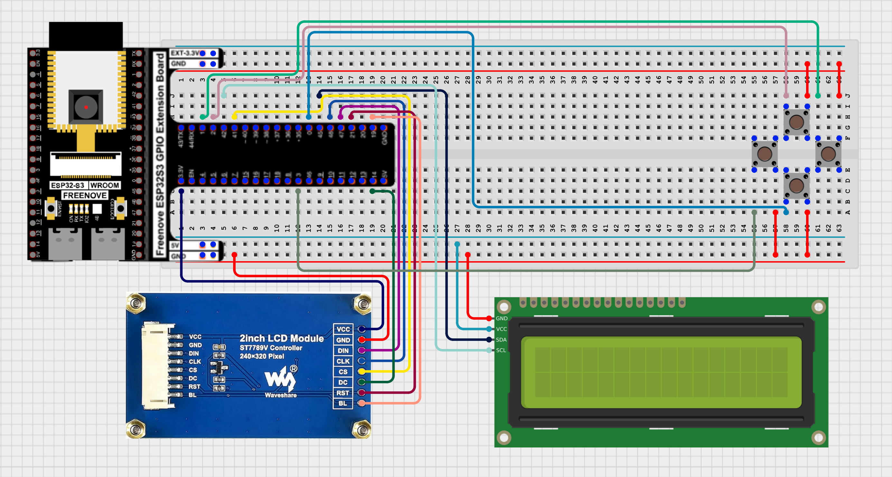

[View interactive diagram](https://app.cirkitdesigner.com/project/baf46bd3-12f5-495c-ad0b-167fc3753eb9)

#### ST7789 Display (SPI)

| Pin | GPIO |
|-----|------|
| DIN/MOSI | 47 |
| CLK/SCLK | 46 |
| CS | 41 |
| DC | 14 |
| RST | 21 |
| BL | 19 (PWM) |

#### 1602 I2C LCD

| Pin | GPIO |
|-----|------|
| SDA | 45 |
| SCL | 42 |

I2C address: `0x27` (PCF8574 backpack)

#### Buttons

| GPIO | Direction |
|------|-----------|
| 3 | Left (back) |
| 0 | Down |
| 2 | Up |
| 1 | Right (select) |

#### Camera (OV3660)

| Function | GPIO |
|----------|------|
| SIOD/SIOC | 4, 5 |
| XCLK | 15 |
| PCLK | 13 |
| VSYNC | 6 |
| HREF | 7 |
| Y2-Y9 | 11, 9, 8, 10, 12, 18, 17, 16 |

#### SD Card (onboard SDMMC)

| Function | GPIO |
|----------|------|
| CMD | 38 |
| CLK | 39 |
| D0 | 40 |

## Building

### Prerequisites

- [ESP-IDF v5.5.x](https://docs.espressif.com/projects/esp-idf/en/latest/esp32s3/get-started/)

### Build & Flash

```bash
idf.py set-target esp32s3
idf.py menuconfig  # Set Spotify credentials under "os32 Configuration"
idf.py build flash monitor
```

### Configuration

Run `idf.py menuconfig` to configure:

- **os32 Configuration > Spotify** — Client ID and redirect URI (required for Spotify app)

## Spotify Setup

The Spotify app uses OAuth 2.0 PKCE for authentication — no client secret needed.

### 1. Create a Spotify App

1. Go to the [Spotify Developer Dashboard](https://developer.spotify.com/dashboard)
2. Create a new app
3. Add a redirect URI — this should point to a static page you host (see step 2)
4. Copy the **Client ID**

### 2. Host the Callback Relay

The ESP32 can't receive HTTPS callbacks directly. A static HTML page acts as a relay:

1. Fork this repo and enable GitHub Pages (Settings > Pages > Source: deploy from `main` branch, `/docs` folder)
2. Set your Pages URL (e.g. `https://yourusername.github.io/os32/spotify/callback.html`) as the redirect URI in the Spotify app settings
3. The page receives the auth code from Spotify and forwards it to the device on the local network

### 3. Configure & Connect

1. Set the Client ID and redirect URI in `menuconfig`
2. Build and flash
3. Open the Spotify app on the device
4. Follow the on-screen setup — scan the QR code or visit the auth URL
5. Log in with your Spotify account
6. The device stores tokens in NVS — you only need to do this once

## Architecture

```
main.cpp              — Hardware init, event loop, button polling
app_manager            — App lifecycle, launcher menu, screen management
app.h                  — Base app interface (on_enter/on_exit/on_update/on_button)
menu                   — Reusable scrollable menu widget

Apps:
  app_spotify          — Spotify remote (uses spotify_auth + spotify_client)
  app_camera           — Camera preview and capture
  app_files            — SD card browser + file server
  app_sysmon           — System monitor
  app_settings         — WiFi, display, date/time, power

Services:
  spotify_auth         — OAuth 2.0 PKCE flow, token management, NVS persistence
  spotify_client       — Spotify Web API client, album art fetch and decode
  wifi_manager         — STA/AP mode, captive portal, NTP sync
  file_server          — HTTP file server with web UI
  sd_manager           — SDMMC initialization and stats
  lcd1602              — 1602 I2C LCD driver
  backlight            — PWM brightness control with NVS persistence
  idle                 — Inactivity timer with configurable sleep
  timezone             — POSIX timezone strings with NVS persistence
  thumbnail            — BMP/JPEG thumbnail decoder (TJpgDec)
  screenshot           — Framebuffer capture to BMP on SD card
  captive_portal       — WiFi setup web portal
```

## UI Style

Gruvbox color palette — dark background (`#282828`), green accents, yellow highlights. No rounded corners, no gradients. Font: [Gohu](https://github.com/hchargois/gohufont).

## License

[MIT](LICENSE)
